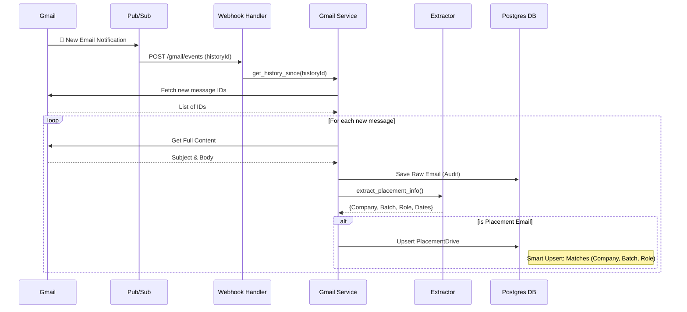
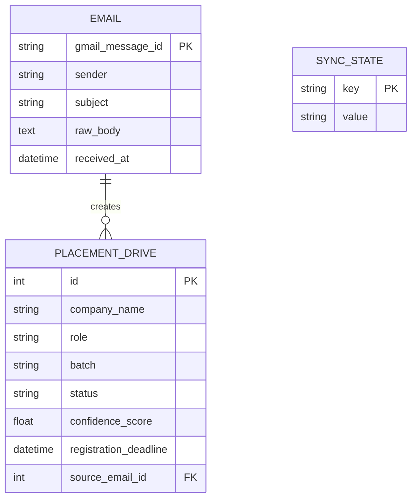

# 📧 PlacementPipeline

> **Real-time campus placement intelligence system** that monitors emails, extracts placement drive information, and powers a live dashboard.

[](https://fastapi.tiangolo.com/)
[](https://python.org/)
[](https://docker.com/)
[](https://supabase.com/)

---

## 📖 How It Works

The system operates as an intelligent pipeline that turns TPO emails into structured database records.

### 🔄 The Data Pipeline



1.  **Listen (Real-time)**:
    *   The app registers a **Gmail Watch** on the registered inbox.
    *   When a new email arrives, Gmail sends a push notification to Google Cloud **Pub/Sub**.
    *   Pub/Sub triggers our `POST /api/v1/gmail/events` webhook.

2.  **Sync (Incremental)**:
    *   The webhook receives a `historyId` (a pointer to the mailbox state).
    *   We query the **Gmail History API** to fetch *only* the messages added since the last sync.

3.  **Extract (Intelligence)**:
    *   **Filter**: Discards non-placement emails using keyword matching.
    *   **Parse**: Uses Regex/NLP to extract Company, Batch, and Dates.

4.  **Store (Deduplication)**:
    *   **Smart Upsert**: A unique constraint on `(Company, Batch, Role)` prevents duplicates.

### 🏗️ Architecture



---

## 🚀 Quick Start

### Prerequisites
*   **Python 3.10+** or **Docker**
*   **Google Cloud Console Project** with Gmail API enabled.
*   `credentials.json` (OAuth Client ID) placed in the root directory.

### Option 1: Docker (Recommended)

1.  **Clone & Configure**:
    ```bash
    git clone https://github.com/Priyanshukumaranand/PlacementPipeline.git
    cd PlacementPipeline
    cp .env.example .env
    # Add your DATABASE_URL to .env
    ```

2.  **Run with Compose**:
    ```bash
    docker-compose up -d --build
    ```

3.  **Access**:
    *   API Docs: `http://localhost:8000/docs`

### Option 2: Local Development

1.  **Setup Virtual Environment**:
    ```bash
    python -m venv .venv
    # Windows
    .venv\Scripts\activate
    # Mac/Linux
    source .venv/bin/activate
    ```

2.  **Install Dependencies**:
    ```bash
    pip install -r requirements.txt
    ```

3.  **Run Server**:
    ```bash
    uvicorn main:app --reload
    ```

---

## 📡 API Endpoints

| Method | Endpoint | Description |
|:---|:---|:---|
| **Dashboard** | | |
| `GET` | `/api/v1/drives` | Get all placement drives. Supports filters: `?batch=2026&status=upcoming` |
| `GET` | `/api/v1/drives/{id}` | Get detailed info for a specific drive. |
| **Gmail Ops** | | |
| `POST` | `/api/v1/gmail/watch/start` | Register the webhook with Gmail (expires in 7 days). |
| `POST` | `/api/v1/process-now` | Manually trigger a scan of the last 20 inbox emails. |

---

## 🔧 Troubleshooting

### 🔑 Authentication Error
> `google.auth.exceptions.RefreshError: Token has been expired or revoked.`

*   **Fix**: Delete `token.json` and restart the application. It will launch a browser window to re-authenticate and generate a fresh token.

### 📭 No Emails Processed
*   Ensure your `credentials.json` is valid.
*   Check if the email subject matches the expected format: `... || Company Name || ...`
*   Verify `PLACEMENT_KEYWORDS` in `app/services/email_extractor.py`.

---

## 📦 Project Structure

```bash
PlacementPipeline/
├── app/
│   ├── api/          # Route handlers (Endpoints)
│   ├── models/       # SQLAlchemy Database Models
│   ├── services/     # Business Logic (Gmail, Extraction, DB)
│   └── database.py   # DB Connection
├── main.py           # App Entrypoint
├── Dockerfile        # Container Config
└── requirements.txt  # Python Dependencies
```

---

## 👨‍💻 Author

**Priyanshu Kumar Anand** - [@Priyanshukumaranand](https://github.com/Priyanshukumaranand)

<p align="center">
  <b>Built with ❤️ for generic email chaos</b>
</p>
