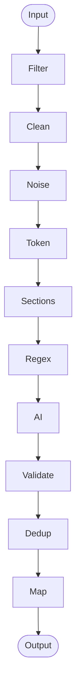

# 📧 PlacementPipeline

> **Real-time campus placement intelligence system** that monitors emails, extracts placement drive information, and powers a live dashboard.

[](https://fastapi.tiangolo.com/)
[](https://python.org/)
[](https://docker.com/)
[](https://supabase.com/)

---

## 📖 How It Works

The system operates as an intelligent pipeline that turns TPO emails into structured database records.

### 🔄 The Data Pipeline


1.  **Listen (Real-time)**:
    *   The app registers a **Gmail Watch** on the registered inbox.
    *   When a new email arrives, Gmail sends a push notification to Google Cloud **Pub/Sub**.
    *   Pub/Sub triggers our `POST /api/v1/gmail/events` webhook.

2.  **Sync (Incremental)**:
    *   The webhook receives a `historyId` (a pointer to the mailbox state).
    *   We query the **Gmail History API** to fetch *only* the messages added since the last sync.

3.  **Extract (Intelligence)**:
    *   **Filter**: Discards non-placement emails using keyword matching.
    *   **Parse**: Uses Regex/NLP to extract Company, Batch, and Dates.

4.  **Store (Deduplication)**:
    *   **Smart Upsert**: A unique constraint on `(Company, Batch, Role)` prevents duplicates.

### 🏗️ Architecture


### 🧠 Intelligence Pipeline (LangGraph)

The system uses a 10-step **LangGraph** pipeline to transform raw emails into structured data.



| Node | Function | How it works |
|:---|:---|:---|
| **1. filter_sender** | Security Gate | • Checks sender against `ALLOWED_SENDERS` (TPO emails).<br>• Scans subject for keywords (Drive, Hiring, Intern). |
| **2. html_to_text** | Normalization | • Uses `BeautifulSoup` to strip HTML tags.<br>• Preserves line breaks for structure. |
| **3. remove_noise** | Scrubber | • Cuts email signatures, "Forwarded message" headers, and legal disclaimers using Regex markers. |
| **4. token_safety** | Constraint | • Truncates body to ~12k chars (~3k tokens) to ensure it fits within Gemini's context window. |
| **5. extract_sections**| Segmentation| • Heuristic search for "Eligibility", "Process", "Dates" headers to focus extraction. |
| **6. regex_extract** | Pattern Matching| • Runs 20+ regex patterns for Batch (e.g., `202[4-6]`), CTC (`\d+\.?\d* LPA`), and Roles. |
| **7. gemini_enhance** | AI Intelligence | • Sends cleaned text + regex hints to **Gemini 1.5 Flash**.<br>• Fills gaps (e.g., implied roles, complex eligibility). |
| **8. validation** | Data Integrity | • Standardizes dates to `YYYY-MM-DD`.<br>• Ensures strings like "8 LPA" become floats like `8.0`. |
| **9. deduplication** | Conflict Check | • Fuzzy matches `(Company, Batch, Role)` against the DB.<br>• Prevents duplicate entries for the same drive. |
| **10. map_to_model** | Formatting | • Maps the validated dictionary to the SQLAlchemy `PlacementDrive` schema fields. |

---

## 🚀 Quick Start

### Prerequisites
*   **Python 3.10+** or **Docker**
*   **Google Cloud Console Project** with Gmail API enabled.
*   `credentials.json` (OAuth Client ID) placed in the root directory.

### Option 1: Docker (Recommended)

1.  **Clone & Configure**:
    ```bash
    git clone https://github.com/Priyanshukumaranand/PlacementPipeline.git
    cd PlacementPipeline
    cp .env.example .env
    # Add your DATABASE_URL to .env
    ```

2.  **Run with Compose**:
    ```bash
    docker-compose up -d --build
    ```

3.  **Access**:
    *   API Docs: `http://localhost:8000/docs`

### Option 2: Local Development

1.  **Setup Virtual Environment**:
    ```bash
    python -m venv .venv
    # Windows
    .venv\Scripts\activate
    # Mac/Linux
    source .venv/bin/activate
    ```

2.  **Install Dependencies**:
    ```bash
    pip install -r requirements.txt
    ```

3.  **Run Server**:
    ```bash
    uvicorn main:app --reload
    ```

---

## 📡 API Endpoints

| Method | Endpoint | Description |
|:---|:---|:---|
| **Dashboard** | | |
| `GET` | `/api/v1/drives` | Get all placement drives. Supports filters: `?batch=2026&status=upcoming` |
| `GET` | `/api/v1/drives/{id}` | Get detailed info for a specific drive. |
| **Gmail Ops** | | |
| `POST` | `/api/v1/gmail/watch/start` | Register the webhook with Gmail (expires in 7 days). |
| `POST` | `/api/v1/process-now` | Manually trigger a scan of the last 20 inbox emails. |

---

## 🔧 Troubleshooting

### 🔑 Authentication Error
> `google.auth.exceptions.RefreshError: Token has been expired or revoked.`

*   **Fix**: Delete `token.json` and restart the application. It will launch a browser window to re-authenticate and generate a fresh token.

### 📭 No Emails Processed
*   Ensure your `credentials.json` is valid.
*   Check if the email subject matches the expected format: `... || Company Name || ...`
*   Verify `PLACEMENT_KEYWORDS` in `app/services/email_extractor.py`.

---

## 📦 Project Structure

```bash
PlacementPipeline/
├── app/
│   ├── api/          # Route handlers (Endpoints)
│   ├── models/       # SQLAlchemy Database Models
│   ├── services/     # Business Logic (Gmail, Extraction, DB)
│   └── database.py   # DB Connection
├── main.py           # App Entrypoint
├── Dockerfile        # Container Config
└── requirements.txt  # Python Dependencies
```

---

## 👨‍💻 Author

**Priyanshu Kumar Anand** - [@Priyanshukumaranand](https://github.com/Priyanshukumaranand)

<p align="center">
  <b>Built with ❤️ for generic email chaos</b>
</p>
