# 📧 PlacementPipeline

> **Real-time campus placement intelligence system** that monitors emails, extracts placement drive information, and powers a live dashboard.

[](https://fastapi.tiangolo.com/)
[](https://python.org/)
[](https://docker.com/)
[](https://supabase.com/)

---

## 📖 How It Works

The system operates as an intelligent pipeline that turns TPO emails into structured database records.

### 🔄 The Data Pipeline


1.  **Listen (Real-time)**:
    *   The app registers a **Gmail Watch** on the registered inbox.
    *   When a new email arrives, Gmail sends a push notification to Google Cloud **Pub/Sub**.
    *   Pub/Sub triggers our `POST /api/v1/gmail/events` webhook.

2.  **Sync (Incremental)**:
    *   The webhook receives a `historyId` (a pointer to the mailbox state).
    *   We query the **Gmail History API** to fetch *only* the messages added since the last sync.

3.  **Extract (Intelligence)**:
    *   **Filter**: Discards non-placement emails using keyword matching.
    *   **Parse**: Uses Regex/NLP to extract Company, Batch, and Dates.

4.  **Store (Deduplication)**:
    *   **Smart Upsert**: A unique constraint on `(Company, Batch, Role)` prevents duplicates.

### 🏗️ Architecture


### 🧠 LangGraph Pipeline (The Core)

The system uses **LangGraph** (by LangChain) for stateful, graph-based orchestration. This is like a smart state machine that processes emails step-by-step with **conditional routing**.

```mermaid
graph LR
    subgraph "🔍 Filtering"
        A[📧 Email Input] --> B{Filter Sender}
        B -->|❌ Not TPO| X[🚫 END]
        B -->|✅ TPO Email| C[Process Text]
    end
    
    subgraph "🧹 Processing"
        C --> D[Extract & Validate]
    end
    
    subgraph "💾 Storage"
        D --> E{Duplicate?}
        E -->|Yes| X
        E -->|No| F[Save to DB]
        F --> G[✅ Done]
    end
```



#### Why LangGraph?

| Feature | Traditional Code | LangGraph |
|---------|------------------|-----------|
| **Control Flow** | Nested if-else | Visual graph with conditional edges |
| **Error Handling** | Try-catch everywhere | Built-in state recovery |
| **Early Exit** | Manual returns | `add_conditional_edges()` |
| **Debugging** | Print statements | Graph visualization |

#### Node Breakdown

| Node | Purpose | Key Tech |
|:-----|:--------|:---------|
| **1. Filter Sender** | Security gate - only TPO emails pass | Regex, keyword matching |
| **2. Process Text** | HTML→Text, remove noise, extract dates/URLs | BeautifulSoup, Regex |
| **3. Extract & Validate** | Get company, role, CTC using Regex + Gemini AI | Regex patterns + Gemini 1.5 Flash |
| **4. Check Duplicate** | Fuzzy match against existing DB records | String similarity |
| **5. Save to DB** | Upsert placement drive with smart conflict resolution | SQLAlchemy upsert |

#### Example Flow

```
Input: "Flipkart Campus Drive || 2026 Batch || SDE Role"
       ↓
[Filter] ✅ From @iiit-bh.ac.in + has "campus drive"
       ↓
[Process] → Clean HTML, extract "2026", "SDE", URLs
       ↓
[Extract] → Regex: company="Flipkart", Gemini: CTC="24 LPA"
       ↓
[Dedup] ✅ New drive (not in DB)
       ↓
[Save] → INSERT PlacementDrive(company="Flipkart", batch="2026", role="SDE")
```

---

## 🚀 Quick Start

### Prerequisites
*   **Python 3.10+** or **Docker**
*   **Google Cloud Console Project** with Gmail API enabled.
*   `credentials.json` (OAuth Client ID) placed in the root directory.

### Option 1: Docker (Recommended)

1.  **Clone & Configure**:
    ```bash
    git clone https://github.com/Priyanshukumaranand/PlacementPipeline.git
    cd PlacementPipeline
    cp .env.example .env
    # Add your DATABASE_URL to .env
    ```

2.  **Run with Compose**:
    ```bash
    docker-compose up -d --build
    ```

3.  **Access**:
    *   API Docs: `http://localhost:8000/docs`

### Option 2: Local Development

1.  **Setup Virtual Environment**:
    ```bash
    python -m venv .venv
    # Windows
    .venv\Scripts\activate
    # Mac/Linux
    source .venv/bin/activate
    ```

2.  **Install Dependencies**:
    ```bash
    pip install -r requirements.txt
    ```

3.  **Run Server**:
    ```bash
    uvicorn main:app --reload
    ```

---

## 📡 API Endpoints

| Method | Endpoint | Description |
|:---|:---|:---|
| **Dashboard** | | |
| `GET` | `/api/v1/drives` | Get all placement drives. Supports filters: `?batch=2026&status=upcoming` |
| `GET` | `/api/v1/drives/{id}` | Get detailed info for a specific drive. |
| **Gmail Ops** | | |
| `POST` | `/api/v1/gmail/watch/start` | Register the webhook with Gmail (expires in 7 days). |
| `POST` | `/api/v1/process-now` | Manually trigger a scan of the last 20 inbox emails. |

---

## 🔧 Troubleshooting

### 🔑 Authentication Error
> `google.auth.exceptions.RefreshError: Token has been expired or revoked.`

*   **Fix**: Delete `token.json` and restart the application. It will launch a browser window to re-authenticate and generate a fresh token.

### 📭 No Emails Processed
*   Ensure your `credentials.json` is valid.
*   Check if the email subject matches the expected format: `... || Company Name || ...`
*   Verify `PLACEMENT_KEYWORDS` in `app/services/email_extractor.py`.

---

## 📦 Project Structure

```bash
PlacementPipeline/
├── app/
│   ├── api/v1/endpoints/  # FastAPI route handlers
│   ├── models/            # SQLAlchemy models (Email, PlacementDrive)
│   ├── services/          # Business logic
│   │   ├── langgraph_pipeline.py  # Core LangGraph pipeline
│   │   ├── gmail_service.py       # Gmail API integration
│   │   ├── regex_extractor.py     # Pattern matching
│   │   ├── gemini_extractor.py    # AI extraction
│   │   ├── text_cleaner.py        # HTML/noise processing
│   │   └── db_service.py          # Database operations
│   └── database.py
├── tests/                 # Test suite
│   └── test_endpoints.py
├── .github/workflows/     # CI/CD pipelines
├── main.py                # App entrypoint
├── pyproject.toml         # Python project config
├── requirements.txt
├── Dockerfile
├── docker-compose.yml
└── README.md
```

---

## 👨‍💻 Author

**Priyanshu Kumar Anand** - [@Priyanshukumaranand](https://github.com/Priyanshukumaranand)

<p align="center">
  <b>Built with ❤️ for generic email chaos</b>
</p>
